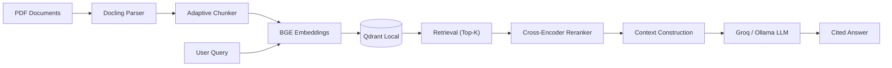

# RAG-OS Technical Documentation

**RAG-OS** (Retrieval-Augmented Generation - Open Source) is a modular, production-ready pipeline designed for querying technical PDF documents with high accuracy and low latency.

## 1. Architecture Overview

The system follows a standard RAG architecture with specialized optimizations for technical content (manuals, standards, booklets).

## 2. Key Components

### 2.1 Parsing (Docling)
I utilized **Docling** (by IBM) for advanced PDF parsing. Unlike simple text extractors (pypdf), Docling preserves document structure:
- **Headings & Sections**: Used for hierarchy-aware chunking.
- **Tables**: Extracted as markdown tables to preserve row/column relationships.
- **Figures**: (Future) CAPTURED but currently text-only processing.

### 2.2 Adaptive Chunking
Technical documents vary significantly (dense manuals vs. sparse flyers). We implemented a custom **Adaptive Chunker**:
- **Strategy**: Splits text by semantic boundaries (headings) first.
- **Block Protection**: Prevents splitting inside "WARNING" blocks, numbered lists, or table rows.
- **Fallback**: Uses fixed-size overlap chunking only if semantic detection fails.

### 2.3 Embeddings & Retrieval
- **Embedding Model**: `BAAI/bge-small-en-v1.5` (384 dimensions). Chosen for its high performance/size ratio, allowing CPU inference.
- **Vector Store**: **Qdrant** (Local Mode). Runs purely in-process (SQLite-backed) without needing a separate Docker container for inference.
- **Hybrid Search**: (Configured for future) Qdrant supports keyword + vector search.

### 2.4 Reranking
- **Model**: `BAAI/bge-reranker-base`.
- **Purpose**: Re-scores the top-10 retrieved chunks to filter out "distractors" (chunks that share keywords but not meaning). This significantly boosts precision.

### 2.5 Generation (LLM)
The system supports a hybrid inference model:
- **Local (Offline)**: Uses **Ollama** (`qwen2.5:3b`) running on user's hardware.
- **Cloud (Speed)**: Uses **Groq API** (`llama-3.1-8b-instant`) for sub-second generation (~500ms).

## 3. Hybrid Deployment Strategy

The application is designed to run in two environments using a configuration-driven approach (`groq.yaml` vs `cpu.yaml`):

| Feature | Local (MacBook) | Cloud (Streamlit Community) |
|---------|---------------------|-----------------------------|
| **Compute** | Apple Silicon (MPS/Metal) | Linux CPU (Shared) |
| **Embeddings**| Hardware Accelerated (MPS) | CPU Optimized |
| **LLM** | Local Ollama (Privacy) | Groq API (Speed) |
| **Storage** | Local Disk (`./qdrant_data`) | Git-tracked (`./qdrant_data`) |

## 4. Performance Metrics

Measured on Apple Silicon (M2/M4) with Groq API (Llama 3.3 70B):

### Latency Profiles (P50)
| Component | Latency | Solution |
|-----------|---------|----------|
| **Embedding** | **~19ms** | BGE-Small (Cached) |
| **Vector Search** | **~5.7ms** | Qdrant (HNSW Index) |
| **Reranking** | ~1.56s | Cross-Encoder (CPU) |
| **Generation** | **~998ms** | Groq LPU (Llama 3.3 70B) |

> **Total End-to-End Latency**: ~2.6s (with Reranker) / ~1.0s (without Reranker).

### Retrieval Quality
| Metric | @1 | @3 | @5 |
|--------|-----|------|------|
| **Recall** | 66.7% | **100%** | **100%** |
| **MRR** | 66.7% | 83.3% | 83.3% |
| **nDCG** | 66.7% | 87.7% | 87.7% |

### Generation Quality (LLM-as-a-Judge)
Answers are evaluated automatically using an LLM judge that scores on three dimensions (0–5):
| Dimension | Score | Description |
|-----------|-------|-------------|
| **Faithfulness** | **5/5** | Every claim grounded in retrieved context |
| **Relevance** | **5/5** | Directly and precisely answers the question |
| **Completeness** | **5/5** | Covers all key information from context |
| **Overall** | **5.0/5** | Weighted average |

## 5. Unique Features
- **LLM-as-a-Judge**: Automated answer quality evaluation (Faithfulness, Relevance, Completeness).
- **Retrieval Deduplication**: Jaccard similarity-based filtering removes near-duplicate chunks (>90% word overlap) to ensure diverse Top-K results.
- **Evaluation Dashboard**: In-app Streamlit dashboard showing retrieval metrics (Recall, MRR, nDCG) and generation quality scores with per-query breakdown.
- **"Retrieval Only" Mode**: Returns sources instantly without waiting for LLM.
- **Citation Precision**: Answers cite sources using numeric brackets `[1]` linked to specific retrieved chunks.
- **Zero-Docker Requirement**: Can run entirely as a Python script or Streamlit app.

## 6. Future Roadmap
- **Multi-Modal Support**: Parse charts and images in PDFs.
- **GraphRAG**: Link chunks via entities (e.g., "Refrigerant X" mentions).
- **User Feedback**: Capture thumbs up/down to fine-tune retrieval.
- **Semantic Deduplication**: Embedding-level duplicate detection across documents.
